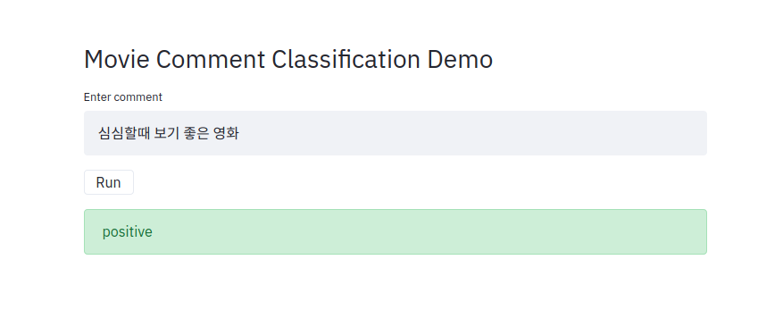

# simple Keras workout

## prerequisites
gensim==3.8.3
konlpy==0.5.2
mecab-python==1.0.0
pybind11==2.5.0
pysocks==1.7.1
streamlit==0.65.0
tensorflow-gpu==2.2.0
tqdm==4.48.0

## structure
python generator -> token embedding -> bidirectional lstm -> softmax

initialize embedding layer with pretrained w2v

## usage

### train w2v

```bash
python3 main.py --job w2v
```

### make token 2 id file

```bash
python3 main.py --job t2id
```

### train model

```bash
python3 main.py --job train
```

### run demo app

```bash
streamlit run demo.py
```
</img>

## reference 

movie comment data: https://github.com/e9t/nsmc
