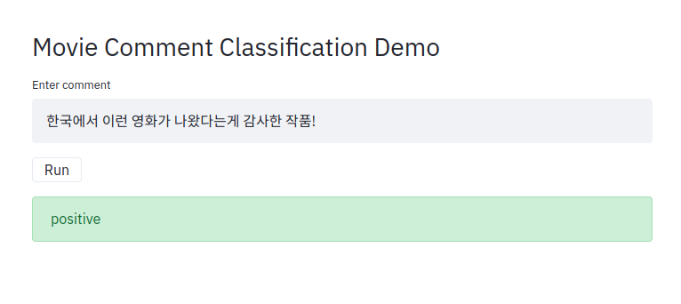

# simple LSTM example with self-attentive layer (tf 1.x)
## prerequisites
python==3.x

absl-py==0.9.0

tqdm==4.43.0

streamlit==0.57.0

tensorflow-gpu==2.0.0  (tf1.x style, but tested on tf2.0)
```python
import tensorflow.compat.v1 as tf
tf.disable_v2_behavior()
```

## structure
python generator -> tf iterator -> character embedding -> bidirectional lstm -> self-attentive layer -> softmax

## usage
### start training
```bash
python3 main.py --job train
```
checkpoints, summary saved in "checkpoints/{timestamp}"
### run demo application
```bash
streamlit run demo.py 
```
try on: http://localhost:8501/


</img>


## reference
self-attentive layer: https://github.com/flrngel/Self-Attentive-tensorflow

movie comment data: https://github.com/e9t/nsmc
